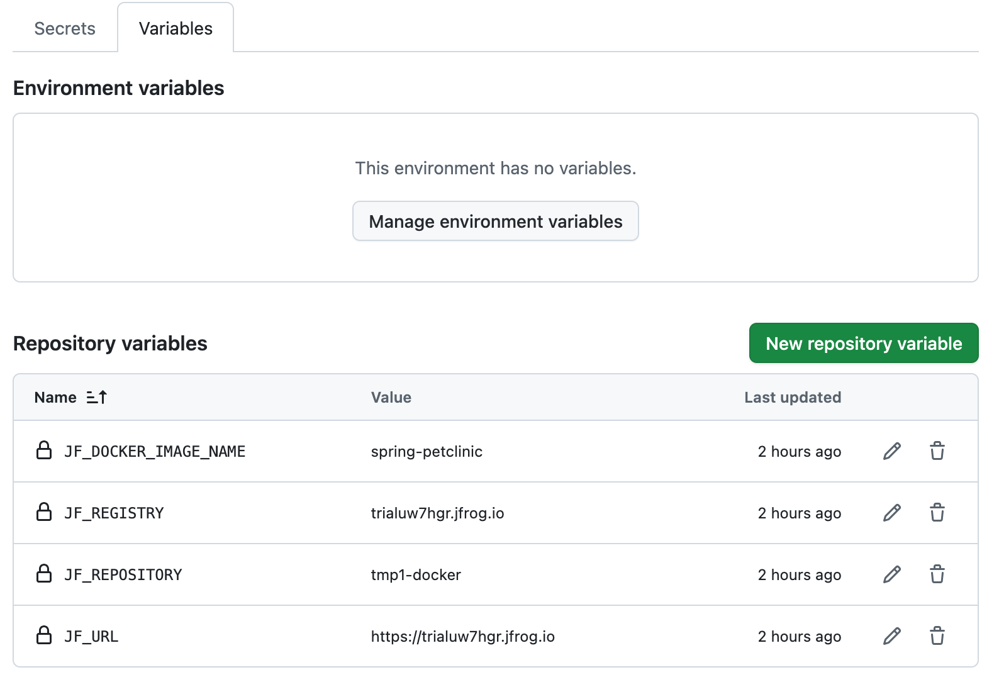

# JFrog CI/CD sample pipeline for the Spring PetClinic Sample Application


## Project Overview

This project demonstrates a CI/CD pipeline using GitHub Actions for the Spring PetClinic application and JFrog. The pipeline includes the following steps:

- Validating dependencies
- Compiling the code
- Runnning tests
- Packaging the application as a Docker image
- Publishing the image to JFrog Artifactory
- Performing Xray security scan on the image

All dependencies are resolved from Maven Central.


## SpringPetClinic Sample Application

[spring-petclinic](https://github.com/spring-projects/spring-petclinic)


## Project Structure

Here are the main modifications compared to the original spring-petclinic project.

- `.github/workflows/ci.yml` - GitHub Actions workflow definition for JFrog CI.
- `Dockerfile` - Docker image build instraction
- `pom.xml` - Updated pom.xml file to resolve dependencies from Maven central
- `deliverables/xray-scan-result.json` - Exported scan result from JFrog
- `README.md` - This file


## How to Run the Project

### Prerequisites:

- Docker installed
- Git installed (optional for local testing/updating)
- JDK 17+ (optional for local testing)
- Maven (optional for local testing)
- JFrog CLI (optional for local testing)


### Steps:

#### 1. Import repository under your account

 1.1) Click "+" icon at the top right in any GitHub page, then select "Import repository".

 1.2) Enter `https://github.com/mikio-seto/spring-petclinic-jfrog-ci` in "The URL for your sourcer repository" field.

 1.3) Name prefered repository name, and click "Begin import" button.


#### 2. Setup Repository and JFrog CI Tool

 2.1) Login to JFrog and go to JFrog Platform.

 2.2) Select "Administration" in JFrog Platform.

 2.3) Click "Create a Repository" button, and create a Docker repository.

 2.4) In the Set UP Client/CI Tool dialog, select `CI TOOL -> GitHub Actions -> Existing Project`.

 2.5) Generate Access Token by clicking "Generate" and make a note for `JF_URL` and `JF_ACCESS_TOKEN` for the later steps.

 2.6) Close the dialog. 

#### 3. Assign Action secrets and variables for your preference

 3.1) Go to the repository created in the step 1, and click "Settings" tab at the top of the page.

 3.2) In the left hand pane, selecct "Actions" under "Secrets and variables".

 3.3) Select "Secrets" tab in the right hand, click "New repository secret" button. Enter `JF_ACCESS_TOKEN` and its value \(noted at step 2.5\) above\), then click "Add secret" button.

 3.4) Select "Variables" tab, click "New repository variable" button. Enter `JF_URL` and its value \(noted at step 2.5\) above\), then click "Add variable" buttons.

 3.5) Please apply the same process to add `JF_REGISTRY`, `JF_REPOSITORY` and `JF_DOCKER_IMAGE_NAME` to Variables. For `JF_REGISTRY`, you can simply remove `https://` from `JF_URL` value, as it represents the registry key. You can name `JF_REPOSITORY` and `JF_DOCKER_IMAGE_NAME` as you prefer.

Please note `JF_RESISTRY`, `JF_REPOSITORY` and `JF_DOCKER_IMAGE_NAME` will be refered for the later step to pull docker image from the artifactory. After the variable assignments, you can see repository variables like below.



#### 4. Run CI in GitHub Actions

 4.1) In the GitHub repository, click "Actions" tab at the top of the page.

 4.2) Select `CI with Maven and JFrog` workflow in the left hand pane, and click `Run workflow -> Run workflow`. Wait until the workflow completed.


#### 5. Download docker image from JFrog Artifactory and run it in local machine.

 5.1) Run following docker commands on your command line.
```bash
docker login -u<your account> <JF_REGISTRY>
docker pull <JF_REGISTRY>/<JF_REPOSITORY>/<JF_DOCKER_IMAGE_NAME>:latest
docker run -p 8080:8080 <JF_REGISTRY>/<JF_REPOSITORY>/<JF_DOCKER_IMAGE_NAME>:latest
```

 5.2) Visit [localhost:8080](http://localhost:8080) in your browser.


## License

This project is released under version 2.0 of the [Apache License](https://www.apache.org/licenses/LICENSE-2.0).
